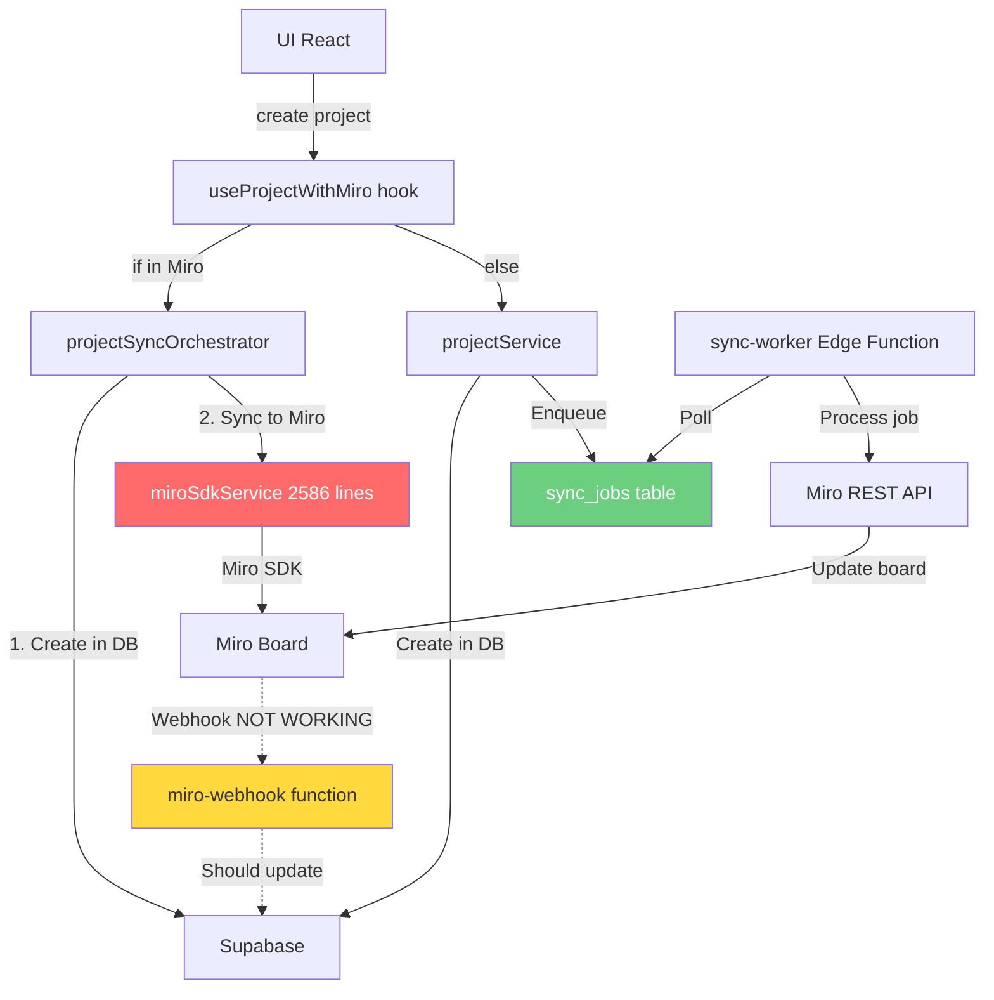

# ANÁLISE ARQUITETURAL COMPLETA E RECONSTRUÇÃO DO SISTEMA
## Miro App - Brianna Dawes Studios

**Data da Análise:** 2025-12-22
**Arquiteto:** CTO Analysis / Claude Code
**Escopo:** Sistema completo (Frontend, Backend, Integrações, Banco de Dados)

---

## 📋 SUMÁRIO EXECUTIVO (CTO SUMMARY)

### Status Atual: ⚠️ **CRÍTICO - Requer Reconstrução Estrutural**

O sistema apresenta **múltiplos pontos de falha arquitetural** que comprometem:
- **Consistência de dados** (Miro ≠ Supabase)
- **Escalabilidade** (lógica de negócio no frontend)
- **Manutenibilidade** (responsabilidades dispersas)
- **Confiabilidade** (race conditions, sincronização dual)

### Problemas Críticos Identificados

| Gravidade | Problema | Impacto | Risco |
|-----------|----------|---------|-------|
| 🔴 ALTA | **Sincronização Dual** (Client + Server) | Race conditions, estados inconsistentes | DADOS |
| 🔴 ALTA | **Frontend = Backend** (2586 linhas de lógica de negócio no client) | Violação de segurança, impossível escalar | SEGURANÇA |
| 🔴 ALTA | **Sem Source of Truth** único para sync state | Conflitos entre sync_jobs, projects.sync_status, miro_item_map | DADOS |
| 🟡 MÉDIA | **Webhook não implementado** | Miro → DB sync quebrado | SYNC |
| 🟡 MÉDIA | **Sem Event Sourcing** | Impossível rastrear mudanças, audit trail incompleto | COMPLIANCE |
| 🟡 MÉDIA | **OAuth Token Refresh** não claro | Tokens podem expirar silenciosamente | DISPONIBILIDADE |

### Recomendação Principal

**Reconstruir o sistema em 3 fases**, priorizando:
1. **Fase 1 (Urgente):** Centralizar sincronização no backend, desabilitar sync dual
2. **Fase 2 (Estrutural):** Implementar Event Sourcing + Outbox Pattern
3. **Fase 3 (Evolução):** Webhook real, multi-board, orquestração avançada

---

## 1️⃣ MAPA COMPLETO DO SISTEMA (VISÃO MACRO)

### 1.1 Domínios Identificados

```
Miro App for Brianna Dawes Studios
│
├─ 📦 FEATURES (Domínios de Negócio)
│  ├─ auth         → Autenticação (Login, Miro OAuth, Session Management)
│  ├─ projects     → Projetos (CRUD, Briefing, Status Lifecycle)
│  ├─ deliverables → Entregáveis (versões, aprovações, feedback)
│  ├─ boards       → Integração Miro (Sync Services, SDK Wrapper)
│  ├─ reports      → Relatórios e Analytics
│  ├─ admin        → Painel Admin (User Management, Sync Health, System)
│  └─ settings     → Configurações gerais
│
├─ 🔧 SHARED (Infraestrutura Compartilhada)
│  ├─ ui           → Design System (Button, Card, Dialog, Toast...)
│  ├─ lib          → Utilitários (httpClient, logger, miroAdapter, queryClient)
│  ├─ core         → Abstrações (UseCase, Repository, EventBus)
│  └─ config       → Environment, Roles, Constantes
│
├─ 🗄️ SUPABASE (Backend)
│  ├─ migrations   → 57 migrations (schema evolution)
│  ├─ functions    → 6 Edge Functions (Deno runtime)
│  │  ├─ projects-create  → Server-side project creation
│  │  ├─ projects-update  → Server-side project update
│  │  ├─ sync-worker      → Durable sync job processor (🔥 CRITICAL)
│  │  ├─ miro-oauth-start → OAuth flow iniciação
│  │  ├─ miro-oauth-callback → OAuth callback handler
│  │  └─ miro-webhook     → Miro events (⚠️ stub, not implemented)
│  └─ _shared      → Código compartilhado entre Edge Functions
│
└─ 🎨 MIRO INTEGRATION (3 entry points)
   ├─ index.html       → Main panel (sidebar)
   ├─ app.html         → Full app interface
   └─ board-modal.html → Modal dialogs from board
```

### 1.2 Fluxo de Dados (Estado Atual)



**🚨 PROBLEMA CRÍTICO:** Dois caminhos diferentes fazem a mesma coisa:
- **Path A:** UI → Orchestrator → miroSdkService → Miro SDK (client-side)
- **Path B:** UI → DB → sync_jobs → sync-worker → Miro REST API (server-side)

**Resultado:** Race conditions, duplicação, estados inconsistentes

### 1.3 Estado Persistido vs Temporário vs Derivado

| Tipo | Onde | Exemplos | Problema Atual |
|------|------|----------|----------------|
| **Persistido** | Supabase Postgres | projects, deliverables, users, sync_jobs, miro_item_map | ✅ OK |
| **Temporário** | React Query Cache | projectKeys.list(), projectKeys.detail() | ✅ OK |
| **Derivado** | Miro Board | Cards, Frames (criados a partir do DB) | ❌ Podem ficar out-of-sync |
| **Estado de Sync** | 3 lugares diferentes! | projects.sync_status, sync_jobs.status, frontend state | 🔴 **SEM SOURCE OF TRUTH** |

---

## 2️⃣ DIAGNÓSTICO CRÍTICO (SEM FILTRO)

### 2.1 ❌ Problema #1: Sincronização Dual (Race Conditions)

**Onde:** `useProjectWithMiro.ts` + `sync-worker/index.ts`

**O que está quebrado:**

```typescript
// Frontend (useProjectWithMiro.ts:88-116)
if (isInMiro && miro) {
  // PATH A: Sync direto via Miro SDK (client-side)
  const result = await projectSyncOrchestrator.createProjectWithSync({
    ...projectInput,
    briefing,
  });
}

// Backend (sync-worker/index.ts:858-1140)
// PATH B: Sync via job queue (server-side)
const cardsRes = await miroListCards(miroAccessToken, boardId);
const cardId = await miroCreateCard(...);
```

**Problema:**
1. User cria projeto no Miro App (PATH A executa)
2. Ao mesmo tempo, `syncJobQueueService.enqueue('project_sync')` é chamado (linha 76)
3. `sync-worker` pega o job e tenta criar o mesmo card (PATH B)
4. **Resultado:** Card duplicado OU erro de conflito

**Gravidade:** 🔴 **ALTA** - Pode corromper dados
**Impacto em Escala:** Quanto mais usuários, mais race conditions
**Classificação:** Race Condition, Falta de Idempotência

### 2.2 ❌ Problema #2: Frontend Atuando como Backend

**Onde:** `miroSdkService.ts` (2586 linhas!)

**Evidências:**

```typescript
// src/features/boards/services/miroSdkService.ts
export class MiroTimelineService {
  // 800+ linhas de lógica complexa NO FRONTEND
  async initializeTimeline(): Promise<void> {
    // Cria frame, colunas, headers...
    // ISSO DEVERIA SER SERVER-SIDE!
  }

  async syncProject(project: Project): Promise<void> {
    // Cria/atualiza cards
    // Calcula posições
    // Gerencia estado
    // LÓGICA DE NEGÓCIO NO FRONTEND!
  }
}

export class MiroProjectRowService {
  // 700+ linhas criando briefing frames
  async createProjectRow(project: Project, briefing: ProjectBriefing) {
    // Cria 9 campos de briefing
    // Formata HTML
    // ISSO É BACKEND WORK!
  }
}
```

**Problemas:**

1. ❌ **Segurança:** Qualquer user pode abrir DevTools e manipular o código
2. ❌ **Performance:** 2586 linhas carregadas no bundle
3. ❌ **Manutenibilidade:** Lógica duplicada (client SDK + server REST API)
4. ❌ **Testabilidade:** Impossível testar sem Miro SDK mockado
5. ❌ **Escalabilidade:** Cada client executa lógica pesada

**Gravidade:** 🔴 **ALTA** - Violação arquitetural fundamental
**Impacto em Escala:** Impossível adicionar novos times sem reescrever
**Classificação:** Violação de Separation of Concerns, Segurança

### 2.3 ❌ Problema #3: Sem Source of Truth para Sync State

**Onde:** 3 lugares diferentes

**Estado de sincronização é rastreado em:**

```sql
-- 1. Tabela projects
ALTER TABLE projects ADD COLUMN sync_status TEXT;
ALTER TABLE projects ADD COLUMN sync_error_message TEXT;
ALTER TABLE projects ADD COLUMN sync_retry_count INT;
ALTER TABLE projects ADD COLUMN last_miro_inbound_at TIMESTAMPTZ;
ALTER TABLE projects ADD COLUMN last_miro_outbound_at TIMESTAMPTZ;

-- 2. Tabela sync_jobs
CREATE TABLE sync_jobs (
  id UUID,
  status sync_job_status, -- queued, running, succeeded, failed
  project_id UUID,
  attempt_count INT,
  last_error TEXT
);

-- 3. Tabela miro_item_map
CREATE TABLE miro_item_map (
  board_id TEXT,
  project_id UUID,
  miro_item_id TEXT,
  item_type TEXT -- timeline_card, briefing_frame, version_frame, briefing_field
);
```

**Problema:** Qual é a verdade?

- Se `projects.sync_status = 'synced'` mas `sync_jobs.status = 'failed'` → ?
- Se `miro_item_map` tem um card ID mas o card foi deletado no Miro → ?
- Se `last_miro_outbound_at` é mais recente que `last_synced_at` → ?

**Consequências:**

- Admin Dashboard mostra métricas incorretas
- Retry logic não funciona corretamente
- Impossible to reconstruct sync history

**Gravidade:** 🔴 **ALTA** - Dados inconsistentes
**Impacto em Escala:** Cresce linearmente com número de projetos
**Classificação:** Falta de Event Sourcing, Estado Distribuído

### 2.4 ⚠️ Problema #4: Webhook Não Implementado

**Onde:** `supabase/functions/miro-webhook/index.ts`

**Evidência:**

```typescript
// miro-webhook/index.ts existe mas não processa eventos!
serve(async (req) => {
  // Apenas valida request mas NÃO FAZ NADA com os eventos
  return json({ ok: true });
});
```

**Impacto:**

- ❌ Mudanças no Miro (moveu card, editou campo) **NÃO** atualizam o banco
- ❌ Sync é **unidirecional** (DB → Miro) apenas
- ❌ `last_miro_inbound_at` nunca é atualizado corretamente
- ❌ Users precisam abrir o Miro App para forçar sync

**Gravidade:** 🟡 **MÉDIA** - Funcionalidade quebrada
**Impacto em Escala:** Baixo (workaround: manual sync)
**Classificação:** Funcionalidade Incompleta

### 2.5 ⚠️ Problema #5: Sem Event Sourcing

**Onde:** Sistema inteiro

**O que falta:**

Não existe uma tabela `project_events` ou `domain_events` que registre:

```sql
-- DEVERIA EXISTIR:
CREATE TABLE project_events (
  id UUID PRIMARY KEY,
  aggregate_id UUID, -- project_id
  event_type TEXT, -- project.created, project.status_changed, project.synced_to_miro
  event_data JSONB,
  event_version INT,
  occurred_at TIMESTAMPTZ,
  caused_by UUID -- user_id
);
```

**Problemas Atuais:**

1. ❌ Impossível reconstruir "como chegamos aqui"
2. ❌ Audit trail incompleto (apenas `audit_logs` genérico)
3. ❌ Não dá para replay events se sync falhar
4. ❌ Sem garantia de ordenação (two users editing ao mesmo tempo)

**Gravidade:** 🟡 **MÉDIA** - Compliance e Debug
**Impacto em Escala:** Alto (problemas crescem com volume)
**Classificação:** Falta de Event Sourcing Pattern

### 2.6 ⚠️ Problema #6: OAuth Token Refresh Não Claro

**Onde:** `supabase/functions/_shared/miroTokens.ts`

**Evidência:**

```typescript
// _shared/miroTokens.ts existe e tem decrypt logic
export async function getMiroAccessToken(
  supabase,
  { boardId, clientId, clientSecret, encryptionKey }
) {
  // Pega token, mas QUANDO refresh?
  // Se expirado, QUEM chama refreshToken()?
}
```

**Problemas:**

- ✅ Tokens são salvos encrypted (bom!)
- ❌ Não há job agendado para refresh antes de expirar
- ❌ Se token expirar, sync falha silenciosamente até user abrir o app
- ❌ Sem monitoring de token expiration

**Gravidade:** 🟡 **MÉDIA** - Disponibilidade
**Impacto em Escala:** Aumenta com número de boards
**Classificação:** Gestão de Credentials

---

## 3️⃣ MODELO DE DADOS (SUPABASE)

### 3.1 Schema Atual (Resumido)

```sql
-- CORE DOMAIN
users (
  id UUID PK,
  auth_user_id UUID UNIQUE, -- FK to auth.users
  email TEXT UNIQUE,
  name TEXT,
  role user_role, -- admin, designer, client
  avatar_url TEXT,
  is_super_admin BOOLEAN,
  created_at TIMESTAMPTZ
);

projects (
  id UUID PK,
  name TEXT NOT NULL,
  description TEXT,
  status project_status, -- draft, in_progress, review, done, archived
  priority project_priority, -- low, medium, high, urgent
  client_id UUID FK users(id),
  miro_board_id TEXT,
  miro_board_url TEXT,
  miro_card_id TEXT, -- Card no Master Timeline
  miro_frame_id TEXT, -- Briefing Frame
  google_drive_url TEXT,
  briefing JSONB, -- {projectOverview, goals, audience, ...}
  thumbnail_url TEXT,
  -- Sync tracking
  sync_status TEXT, -- pending, syncing, synced, sync_error, not_required
  sync_error_message TEXT,
  sync_retry_count INT DEFAULT 0,
  last_sync_attempt TIMESTAMPTZ,
  last_synced_at TIMESTAMPTZ,
  last_miro_inbound_at TIMESTAMPTZ, -- Last time Miro → DB
  last_miro_outbound_at TIMESTAMPTZ, -- Last time DB → Miro
  -- Dates
  start_date TIMESTAMPTZ,
  due_date TIMESTAMPTZ,
  requested_due_date TIMESTAMPTZ,
  due_date_approved BOOLEAN DEFAULT TRUE,
  completed_at TIMESTAMPTZ,
  archived_at TIMESTAMPTZ,
  created_at TIMESTAMPTZ DEFAULT NOW(),
  updated_at TIMESTAMPTZ DEFAULT NOW()
);

deliverables (
  id UUID PK,
  project_id UUID FK projects(id) ON DELETE CASCADE,
  title TEXT NOT NULL,
  description TEXT,
  status deliverable_status, -- pending, wip, review, approved
  version_number INT,
  due_date TIMESTAMPTZ,
  completed_at TIMESTAMPTZ,
  created_at TIMESTAMPTZ
);

project_designers (
  project_id UUID FK projects(id) ON DELETE CASCADE,
  user_id UUID FK users(id) ON DELETE CASCADE,
  assigned_at TIMESTAMPTZ,
  PRIMARY KEY (project_id, user_id)
);

-- SYNC INFRASTRUCTURE
sync_jobs (
  id UUID PK,
  job_type sync_job_type, -- project_sync, master_board_sync, miro_item_sync
  status sync_job_status, -- queued, running, succeeded, failed, canceled
  project_id UUID FK projects(id) ON DELETE CASCADE,
  board_id TEXT,
  payload JSONB,
  requested_by UUID FK users(id),
  attempt_count INT DEFAULT 0,
  max_attempts INT DEFAULT 5,
  run_at TIMESTAMPTZ DEFAULT NOW(),
  locked_at TIMESTAMPTZ,
  locked_by TEXT, -- worker_id
  last_error TEXT,
  finished_at TIMESTAMPTZ,
  created_at TIMESTAMPTZ,
  updated_at TIMESTAMPTZ
);

miro_item_map (
  id UUID PK,
  board_id TEXT NOT NULL,
  project_id UUID FK projects(id) ON DELETE CASCADE,
  item_type TEXT NOT NULL, -- timeline_card, briefing_frame, version_frame, briefing_field
  miro_item_id TEXT NOT NULL,
  field_key TEXT, -- For briefing_field: projectOverview, goals, etc
  version_number INT, -- For version_frame: 1, 2, 3
  created_at TIMESTAMPTZ,
  updated_at TIMESTAMPTZ,
  UNIQUE (board_id, miro_item_id)
);

miro_oauth_tokens (
  id UUID PK,
  user_id UUID FK users(id),
  board_id TEXT UNIQUE,
  miro_user_id TEXT,
  team_id TEXT,
  access_token_encrypted TEXT NOT NULL,
  refresh_token_encrypted TEXT,
  token_type TEXT,
  scope TEXT,
  expires_at TIMESTAMPTZ,
  last_refreshed_at TIMESTAMPTZ,
  created_at TIMESTAMPTZ,
  updated_at TIMESTAMPTZ
);

miro_oauth_states (
  state TEXT PK,
  user_id UUID FK users(id),
  board_id TEXT,
  created_at TIMESTAMPTZ,
  expires_at TIMESTAMPTZ,
  used_at TIMESTAMPTZ
);

-- AUDIT & LOGS
audit_logs (
  id UUID PK,
  user_id UUID,
  action TEXT,
  resource_type TEXT,
  resource_id UUID,
  changes JSONB,
  created_at TIMESTAMPTZ
);
```

### 3.2 Problemas no Modelo de Dados

#### 🔴 P1: Sync State Fragmentado

```sql
-- Sync state está em 3 lugares:
projects.sync_status, sync_error_message, sync_retry_count
sync_jobs.status, last_error, attempt_count
miro_item_map (existence = sync happened)

-- DEVERIA SER:
sync_state (
  project_id UUID PK,
  status TEXT,
  source TEXT, -- 'client' or 'worker'
  last_sync_at TIMESTAMPTZ,
  last_sync_direction TEXT, -- 'inbound' or 'outbound'
  error_message TEXT,
  retry_count INT,
  job_id UUID FK sync_jobs(id) -- Current running job
);
```

#### 🟡 P2: Falta de Versionamento

```sql
-- Não existe:
project_versions (
  id UUID PK,
  project_id UUID,
  version_number INT,
  snapshot JSONB, -- Full project state
  changed_by UUID,
  changed_at TIMESTAMPTZ
);
```

**Impacto:** Impossível fazer rollback se sync corromper dados

#### 🟡 P3: Briefing como JSONB sem validação

```sql
-- Atual:
briefing JSONB -- Pode ter qualquer coisa

-- DEVERIA SER (com constraint):
briefing JSONB CHECK (
  jsonb_typeof(briefing->'projectOverview') IN ('string', 'null')
  AND jsonb_typeof(briefing->'goals') IN ('string', 'null')
  ...
)
```

### 3.3 Novo Modelo de Dados Proposto

```sql
-- ============================================================================
-- PROPOSED: Event-Sourced Sync Model
-- ============================================================================

-- Single source of truth for ALL events
CREATE TABLE domain_events (
  id UUID PRIMARY KEY DEFAULT gen_random_uuid(),
  stream_id UUID NOT NULL, -- project_id, deliverable_id, etc
  stream_type TEXT NOT NULL, -- 'project', 'deliverable'
  event_type TEXT NOT NULL, -- 'project.created', 'project.synced_to_miro'
  event_version INT NOT NULL,
  event_data JSONB NOT NULL,
  metadata JSONB, -- {user_id, ip_address, source: 'web'|'miro_webhook'|'sync_worker'}
  occurred_at TIMESTAMPTZ NOT NULL DEFAULT NOW(),
  UNIQUE (stream_id, event_version)
);

CREATE INDEX idx_domain_events_stream ON domain_events(stream_id, event_version);
CREATE INDEX idx_domain_events_type ON domain_events(event_type);

-- Sync state derived from events
CREATE TABLE sync_state (
  project_id UUID PRIMARY KEY,
  current_status TEXT NOT NULL, -- pending, syncing, synced, error
  last_outbound_sync_at TIMESTAMPTZ,
  last_inbound_sync_at TIMESTAMPTZ,
  last_sync_event_id UUID FK domain_events(id),
  error_message TEXT,
  retry_count INT DEFAULT 0,
  next_retry_at TIMESTAMPTZ,
  -- Miro references (single source of truth)
  miro_card_id TEXT,
  miro_briefing_frame_id TEXT,
  miro_version_frame_id TEXT,
  updated_at TIMESTAMPTZ DEFAULT NOW()
);

-- Outbox pattern for reliable event publishing
CREATE TABLE outbox (
  id UUID PRIMARY KEY,
  event_id UUID FK domain_events(id),
  destination TEXT, -- 'sync_worker', 'notification_service'
  payload JSONB,
  status TEXT, -- pending, processing, sent, failed
  retries INT DEFAULT 0,
  next_retry_at TIMESTAMPTZ,
  created_at TIMESTAMPTZ DEFAULT NOW(),
  processed_at TIMESTAMPTZ
);

-- Consolidated sync job (replaces current sync_jobs)
CREATE TABLE sync_transactions (
  id UUID PRIMARY KEY,
  project_id UUID NOT NULL,
  direction TEXT NOT NULL, -- 'outbound' (DB→Miro) or 'inbound' (Miro→DB)
  trigger_event_id UUID FK domain_events(id),
  status TEXT NOT NULL, -- queued, running, committed, rolled_back, failed
  started_at TIMESTAMPTZ,
  completed_at TIMESTAMPTZ,
  miro_operations JSONB[], -- [{op: 'create_card', item_id: '...', result: 'success'}]
  db_operations JSONB[], -- [{op: 'update_status', old: 'draft', new: 'in_progress'}]
  error TEXT,
  rollback_reason TEXT
);

-- Simplified miro mapping (single table)
CREATE TABLE miro_items (
  board_id TEXT NOT NULL,
  item_id TEXT NOT NULL,
  item_type TEXT NOT NULL, -- card, frame, text, shape
  entity_type TEXT NOT NULL, -- project, deliverable
  entity_id UUID NOT NULL,
  entity_field TEXT, -- For briefing: 'projectOverview', 'goals', etc
  entity_version INT, -- For version frames: 1, 2, 3
  created_by_sync_tx_id UUID FK sync_transactions(id),
  last_synced_at TIMESTAMPTZ,
  PRIMARY KEY (board_id, item_id)
);
```

**Benefícios:**

✅ **Single Source of Truth:** Todos eventos em `domain_events`
✅ **Auditável:** Pode reconstruir estado a qualquer momento
✅ **Idempotente:** Replay events não quebra nada
✅ **Rastreável:** Cada sync tem `sync_transactions` com todas operações
✅ **Rollback:** Se sync falhar, pode reverter DB usando eventos

---

## 4️⃣ SINCRONIZAÇÃO MIRO ↔ SUPABASE

### 4.1 Estado Atual (Dual Sync)

```
┌─────────────────────────────────────────────────────────────────┐
│                        CURRENT SYNC FLOW                        │
└─────────────────────────────────────────────────────────────────┘

USER CREATES PROJECT IN MIRO APP
│
├─ PATH A: Client-Side Sync (if isInMiro === true)
│  │
│  ├─ useCreateProjectWithMiro()
│  ├─ projectSyncOrchestrator.createProjectWithSync()
│  │  ├─ 1. projectService.createProject() → Supabase INSERT
│  │  ├─ 2. miroTimelineService.syncProject() → Miro SDK create card
│  │  ├─ 3. miroProjectRowService.createProjectRow() → Miro SDK create frames
│  │  └─ 4. projectService.updateSyncStatus('synced')
│  │
│  └─ TAMBÉM enfileira sync job (linha 76-80)
│
└─ PATH B: Server-Side Sync (sempre acontece)
   │
   ├─ syncJobQueueService.enqueue('project_sync')
   ├─ sync-worker polls sync_jobs table
   ├─ Claims job, locks it
   ├─ Fetches project from DB (source of truth)
   ├─ miroCreateCard() via REST API
   ├─ miroCreateFrame() for briefing
   └─ Updates project.sync_status = 'synced'

⚠️ RACE CONDITION: A e B podem executar ao mesmo tempo!
```

### 4.2 Estratégias de Consistência

#### Opção 1: Idempotência com Deduplicação (Quick Fix)

```typescript
// QUICK FIX: Add deduplication key to sync_jobs
await supabase.rpc('enqueue_sync_job', {
  p_job_type: 'project_sync',
  p_project_id: project.id,
  p_dedup_key: `project:${project.id}:${project.updated_at}`, // NEW
  p_payload: {}
});

// In sync-worker:
// SKIP job if project.last_miro_outbound_at > job.created_at
const outboundAt = new Date(project.last_miro_outbound_at);
const jobCreatedAt = new Date(job.created_at);
if (outboundAt > jobCreatedAt) {
  // Already synced by client, skip
  await complete_sync_job(job.id, true, 'skipped:already_synced_by_client');
  continue;
}
```

**Prós:**
✅ Rápido de implementar
✅ Não quebra código existente

**Contras:**
❌ Não resolve problema fundamental (dual sync)
❌ Still has race condition window

#### Opção 2: Desabilitar Client Sync (Recommended)

```typescript
// REMOVE client-side sync completely
export function useCreateProjectWithMiro() {
  return useMutation({
    mutationFn: async (input) => {
      // Create in DB only
      const project = await projectService.createProject(input);

      // Enqueue server-side sync
      await syncJobQueueService.enqueue('project_sync', {
        projectId: project.id,
        boardId: project.miroBoardId
      });

      // Show optimistic UI
      await MiroNotifications.showInfo('Project created! Syncing to board...');

      return project;
    }
  });
}

// Frontend polls sync_state via realtime subscription
const { data: syncState } = useQuery({
  queryKey: ['sync-state', projectId],
  queryFn: () => supabase
    .from('sync_state')
    .select('*')
    .eq('project_id', projectId)
    .single()
});
```

**Prós:**
✅ Elimina race conditions
✅ Single source of sync logic (backend)
✅ Mais fácil de testar e monitorar
✅ Funciona offline (jobs enfileirados)

**Contras:**
❌ Latência percebida (user espera worker pegar job)
❌ Precisa de realtime subscription para UI feedback

#### Opção 3: Event Sourcing + Outbox Pattern (Ideal)

```sql
-- When project is created:
INSERT INTO domain_events (stream_id, event_type, event_data)
VALUES (
  project_id,
  'project.created',
  jsonb_build_object(
    'name', 'New Project',
    'client_id', client_id,
    'briefing', briefing_json
  )
);

-- Trigger: domain_events → outbox
CREATE TRIGGER publish_to_outbox
AFTER INSERT ON domain_events
FOR EACH ROW
EXECUTE FUNCTION publish_event_to_outbox();

-- Separate process: outbox → sync worker
-- Polls outbox every 5s, publishes to sync queue
```

**Prós:**
✅ Garantia de consistência (transacional)
✅ Auditável (full event log)
✅ Idempotente (replay events)
✅ Desacoplado (outbox → multiple consumers)

**Contras:**
❌ Complexo de implementar
❌ Requer infraestrutura adicional

### 4.3 Proposta: Nova Arquitetura de Sync

```
┌────────────────────────────────────────────────────────────────────┐
│                    PROPOSED SYNC ARCHITECTURE                      │
└────────────────────────────────────────────────────────────────────┘

USER ACTION (Create/Update Project)
│
├─ Frontend → Edge Function (projects-create or projects-update)
│  │
│  ├─ Validate input
│  ├─ RBAC check (admin/designer/client permissions)
│  ├─ BEGIN TRANSACTION
│  │  ├─ INSERT INTO projects (...)
│  │  ├─ INSERT INTO domain_events (event_type: 'project.created')
│  │  ├─ INSERT INTO outbox (destination: 'sync_worker', payload: ...)
│  │  └─ COMMIT
│  │
│  └─ Return response to frontend
│
├─ Outbox Processor (Deno Cron or separate worker)
│  │
│  ├─ Every 5 seconds:
│  ├─ SELECT * FROM outbox WHERE status = 'pending' LIMIT 100
│  ├─ FOR EACH message:
│  │  ├─ INSERT INTO sync_jobs (job_type, project_id, payload)
│  │  └─ UPDATE outbox SET status = 'sent'
│  │
│  └─ Retry failed messages with exponential backoff
│
├─ Sync Worker (sync-worker Edge Function)
│  │
│  ├─ Triggered by:
│  │  ├─ HTTP POST from outbox processor
│  │  ├─ OR scheduled every 30s to poll sync_jobs
│  │
│  ├─ Claim next job (FOR UPDATE SKIP LOCKED)
│  ├─ Fetch project from DB (source of truth)
│  ├─ BEGIN SYNC TRANSACTION
│  │  ├─ Create/Update Miro items via REST API
│  │  ├─ INSERT INTO sync_transactions (miro_operations: [...])
│  │  ├─ UPSERT miro_items (board_id, item_id, entity_id)
│  │  ├─ UPDATE sync_state (status: 'synced', last_outbound_sync_at)
│  │  ├─ INSERT domain_events (event_type: 'project.synced_to_miro')
│  │  └─ If all OK: COMMIT, else: ROLLBACK
│  │
│  └─ Complete job (succeeded/failed)
│
└─ Miro Webhook (miro-webhook Edge Function)
   │
   ├─ Receives: { type: 'item:updated', data: { id: 'card-123', ... } }
   ├─ Verify webhook signature
   ├─ BEGIN TRANSACTION
   │  ├─ Lookup project_id from miro_items WHERE item_id = 'card-123'
   │  ├─ Parse changes (position → infer status, dueDate → update DB)
   │  ├─ INSERT domain_events (event_type: 'project.updated_from_miro')
   │  ├─ UPDATE projects SET status, due_date
   │  ├─ UPDATE sync_state (last_inbound_sync_at)
   │  └─ COMMIT
   │
   └─ Return 200 OK to Miro

┌────────────────────────────────────────────────────────────────────┐
│  CONSISTENCY GUARANTEES                                            │
├────────────────────────────────────────────────────────────────────┤
│  ✅ Single sync path (server-only)                                │
│  ✅ Transactional (DB + events atomic)                            │
│  ✅ Idempotent (can replay events/jobs)                           │
│  ✅ Auditable (domain_events log)                                 │
│  ✅ Rollback capable (sync_transactions track all ops)            │
│  ✅ Conflict detection (last_inbound_sync_at vs last_outbound)    │
└────────────────────────────────────────────────────────────────────┘
```

### 4.4 Conflict Resolution Strategy

**Scenario:** User updates project status in DB while another user moves card in Miro

```sql
-- Conflict detection:
SELECT
  p.updated_at AS db_updated_at,
  ss.last_outbound_sync_at,
  ss.last_inbound_sync_at,
  CASE
    WHEN ss.last_inbound_sync_at > ss.last_outbound_sync_at
      THEN 'miro_is_newer'
    WHEN p.updated_at > ss.last_outbound_sync_at
      THEN 'db_is_newer'
    ELSE 'synced'
  END AS sync_status
FROM projects p
JOIN sync_state ss ON ss.project_id = p.id
WHERE p.id = 'project-uuid';

-- Resolution policy:
-- 1. Last Write Wins (simple)
IF miro_event.timestamp > db_update.timestamp THEN
  -- Miro wins, update DB
  UPDATE projects SET status = miro_inferred_status;
ELSE
  -- DB wins, ignore Miro event (will re-sync on next outbound)
  SKIP;
END IF;

-- 2. Operational Transform (advanced)
-- Merge changes intelligently
IF miro_changed_field = 'position' AND db_changed_field = 'briefing' THEN
  -- No conflict, apply both
  UPDATE projects SET
    status = miro_inferred_status,
    briefing = db_new_briefing;
END IF;
```

---

## 5️⃣ FLUXOS CRÍTICOS (PASSO A PASSO)

### 5.1 Fluxo: Criar Projeto

#### **Estado Atual (Dual Sync - Problemático)**

```
┌─────────────────────────────────────────────────────────────────┐
│ STEP 1: User submits form in React                             │
└─────────────────────────────────────────────────────────────────┘
<ProjectForm onSubmit={(data) => createProject.mutate(data)} />

┌─────────────────────────────────────────────────────────────────┐
│ STEP 2: useCreateProjectWithMiro hook                          │
└─────────────────────────────────────────────────────────────────┘
const { isInMiro, miro } = useMiro();

if (isInMiro && miro) {
  // PATH A: Client-side sync
  const result = await projectSyncOrchestrator.createProjectWithSync(input);
  // ⚠️ ALSO enqueues sync job (race condition!)
} else {
  // PATH B: DB-only, sync via worker
  const project = await projectService.createProject(input);
  await syncJobQueueService.enqueue('project_sync', { projectId: project.id });
}

┌─────────────────────────────────────────────────────────────────┐
│ STEP 3a: Client Orchestrator (if in Miro)                      │
└─────────────────────────────────────────────────────────────────┘
projectSyncOrchestrator.createProjectWithSync():
  1. projectService.createProject() → INSERT INTO projects
  2. miroTimelineService.syncProject()
     - miroAdapter.getBoardItems('card') → Find existing cards
     - miroAdapter.createCard() → Create new card in Miro
  3. miroProjectRowService.createProjectRow()
     - miroAdapter.createFrame() → Briefing frame
     - miroAdapter.createShape() × 9 → Briefing fields
  4. projectService.updateSyncStatus('synced')

❌ Problem: If this succeeds, sync_job will DUPLICATE the card!

┌─────────────────────────────────────────────────────────────────┐
│ STEP 3b: Sync Worker (always runs)                             │
└─────────────────────────────────────────────────────────────────┘
sync-worker Edge Function:
  1. claim_next_sync_job() → Lock job
  2. Fetch project from DB
  3. miroCreateCard() via REST API
  4. miroCreateFrame() for briefing
  5. complete_sync_job(succeeded: true)

❌ Problem: If 3a already created card, this creates DUPLICATE!

┌─────────────────────────────────────────────────────────────────┐
│ STEP 4: Error Handling                                         │
└─────────────────────────────────────────────────────────────────┘
if (syncFails) {
  await projectService.updateSyncStatus('sync_error', {
    errorMessage: error.message,
    incrementRetry: true
  });
}

❌ Problem: Which system failed? Client or Worker? No way to know!
```

#### **Estado Proposto (Server-Only Sync)**

```
┌─────────────────────────────────────────────────────────────────┐
│ STEP 1: User submits form                                      │
└─────────────────────────────────────────────────────────────────┘
Same as before

┌─────────────────────────────────────────────────────────────────┐
│ STEP 2: Frontend calls Edge Function                           │
└─────────────────────────────────────────────────────────────────┘
const response = await fetch('/functions/v1/projects-create', {
  method: 'POST',
  headers: { 'Authorization': `Bearer ${token}` },
  body: JSON.stringify(input)
});

┌─────────────────────────────────────────────────────────────────┐
│ STEP 3: Edge Function (projects-create)                        │
└─────────────────────────────────────────────────────────────────┘
serve(async (req) => {
  // Validate + RBAC
  if (!isAdmin(user)) return 403;

  // BEGIN TRANSACTION
  const projectId = await supabase.rpc('create_project_transactional', {
    ...input,
    events: [
      { type: 'project.created', data: input },
      { type: 'sync.requested', data: { direction: 'outbound' } }
    ]
  });
  // COMMIT

  return json({ ok: true, projectId });
});

┌─────────────────────────────────────────────────────────────────┐
│ STEP 4: Database Trigger                                       │
└─────────────────────────────────────────────────────────────────┘
-- After INSERT on domain_events
FOR EACH ROW WHERE event_type = 'sync.requested'
EXECUTE FUNCTION enqueue_to_outbox();

-- Result:
INSERT INTO outbox (destination: 'sync_worker', payload: { project_id: ... })

┌─────────────────────────────────────────────────────────────────┐
│ STEP 5: Outbox Processor (every 5s)                            │
└─────────────────────────────────────────────────────────────────┘
-- Cron job or separate Edge Function
SELECT * FROM outbox WHERE status = 'pending' LIMIT 100;

FOR EACH message:
  INSERT INTO sync_jobs (job_type: 'project_sync', project_id: ...);
  UPDATE outbox SET status = 'sent';

┌─────────────────────────────────────────────────────────────────┐
│ STEP 6: Sync Worker (pulls from queue)                         │
└─────────────────────────────────────────────────────────────────┘
sync-worker (HTTP POST trigger or scheduled):
  1. claim_next_sync_job() → FOR UPDATE SKIP LOCKED
  2. Fetch project (source of truth)
  3. BEGIN TRANSACTION
     - miroCreateCard()
     - miroCreateFrame()
     - INSERT sync_transactions (miro_operations: [...])
     - UPSERT miro_items
     - UPDATE sync_state (status: 'synced')
     - INSERT domain_events (type: 'project.synced_to_miro')
     COMMIT
  4. complete_sync_job(success: true)

┌─────────────────────────────────────────────────────────────────┐
│ STEP 7: Frontend receives realtime update                      │
└─────────────────────────────────────────────────────────────────┘
// Realtime subscription to sync_state
supabase
  .channel('sync-updates')
  .on('postgres_changes', {
    event: 'UPDATE',
    schema: 'public',
    table: 'sync_state',
    filter: `project_id=eq.${projectId}`
  }, (payload) => {
    queryClient.invalidateQueries(['projects', projectId]);
    if (payload.new.status === 'synced') {
      showToast('Project synced to Miro!');
    }
  })
  .subscribe();

┌─────────────────────────────────────────────────────────────────┐
│ STEP 8: Error Handling                                         │
└─────────────────────────────────────────────────────────────────┘
if (miro_call_fails) {
  // ROLLBACK transaction
  UPDATE sync_state SET status = 'error', error_message = ...;
  INSERT domain_events (type: 'sync.failed');
  fail_sync_job(job_id, error, retry_delay_seconds);
}

// Retry with exponential backoff
retry_delay = 30 * 2^(attempt_count - 1) -- 30s, 60s, 120s, ...
```

✅ **Garantias:**

- Single sync path (no race conditions)
- Transactional (DB + events atomic)
- Idempotent (can retry safely)
- Auditable (all events logged)
- Rollback capable (transaction isolation)

### 5.2 Fluxo: Atualizar Projeto via Miro (Webhook)

#### **Estado Atual (Não Implementado)**

```
Miro Webhook → miro-webhook function → return json({ ok: true })
❌ NÃO ATUALIZA O BANCO!
```

#### **Estado Proposto**

```
┌─────────────────────────────────────────────────────────────────┐
│ STEP 1: User moves card in Miro board                          │
└─────────────────────────────────────────────────────────────────┘
User drags card from "IN PROGRESS" column to "REVIEW" column

┌─────────────────────────────────────────────────────────────────┐
│ STEP 2: Miro sends webhook                                     │
└─────────────────────────────────────────────────────────────────┘
POST https://your-app.supabase.co/functions/v1/miro-webhook
{
  "type": "item:updated",
  "data": {
    "id": "card-abc123",
    "type": "card",
    "position": { "x": 350, "y": 200 },
    "modifiedBy": { "id": "miro-user-xyz" }
  },
  "createdAt": "2025-12-22T10:30:00Z"
}

┌─────────────────────────────────────────────────────────────────┐
│ STEP 3: Webhook handler validates                              │
└─────────────────────────────────────────────────────────────────┘
const signature = req.headers.get('X-Miro-Signature');
const isValid = verifyWebhookSignature(body, signature, MIRO_WEBHOOK_SECRET);
if (!isValid) return 401;

┌─────────────────────────────────────────────────────────────────┐
│ STEP 4: Lookup project                                         │
└─────────────────────────────────────────────────────────────────┘
const { data: miroItem } = await supabase
  .from('miro_items')
  .select('entity_id, entity_type, board_id')
  .eq('item_id', 'card-abc123')
  .single();

if (!miroItem) {
  // Unknown item, ignore
  return json({ ok: true, action: 'ignored:unmapped_item' });
}

┌─────────────────────────────────────────────────────────────────┐
│ STEP 5: Infer changes                                          │
└─────────────────────────────────────────────────────────────────┘
const { data: project } = await supabase
  .from('projects')
  .select('*, sync_state(*)')
  .eq('id', miroItem.entity_id)
  .single();

// Infer status from card position
const newStatus = inferStatusFromPosition(webhookData.data.position.x);

// Check for conflict
if (project.updated_at > project.sync_state.last_outbound_sync_at) {
  // DB was updated after last sync, DB wins
  return json({ ok: true, action: 'conflict:db_newer' });
}

┌─────────────────────────────────────────────────────────────────┐
│ STEP 6: Apply changes transactionally                          │
└─────────────────────────────────────────────────────────────────┘
BEGIN TRANSACTION;

-- Insert event
INSERT INTO domain_events (
  stream_id, event_type, event_data, metadata
) VALUES (
  miroItem.entity_id,
  'project.updated_from_miro',
  jsonb_build_object('status', newStatus, 'previous_status', project.status),
  jsonb_build_object('source', 'miro_webhook', 'miro_item_id', 'card-abc123')
);

-- Update project
UPDATE projects
SET status = newStatus, updated_at = NOW()
WHERE id = miroItem.entity_id;

-- Update sync state
UPDATE sync_state
SET last_inbound_sync_at = NOW()
WHERE project_id = miroItem.entity_id;

COMMIT;

┌─────────────────────────────────────────────────────────────────┐
│ STEP 7: Realtime notification to frontend                      │
└─────────────────────────────────────────────────────────────────┘
-- Supabase Realtime automatically broadcasts UPDATE to subscribed clients
-- Frontend invalidates React Query cache and re-fetches
```

---

## 6️⃣ REDESIGN COMPLETO DA ARQUITETURA

### 6.1 Camadas (Clean Architecture)

```
┌─────────────────────────────────────────────────────────────────┐
│                         PRESENTATION                            │
│  React Components, Hooks, UI State                              │
│  • <ProjectForm />, <ProjectCard />                             │
│  • useProjects(), useProjectMutations()                         │
│  • React Query cache                                            │
└─────────────────────────────────────────────────────────────────┘
        ↓ calls
┌─────────────────────────────────────────────────────────────────┐
│                         APPLICATION                             │
│  Use Cases, Orchestration (NO Miro SDK, NO DB direct access)   │
│  • CreateProjectUseCase                                         │
│  • UpdateProjectUseCase                                         │
│  • SyncProjectUseCase                                           │
└─────────────────────────────────────────────────────────────────┘
        ↓ uses
┌─────────────────────────────────────────────────────────────────┐
│                           DOMAIN                                │
│  Entities, Value Objects, Business Rules                        │
│  • Project, Deliverable, Briefing                               │
│  • Validators (Zod schemas)                                     │
│  • Domain events (project:created, project:synced)              │
└─────────────────────────────────────────────────────────────────┘
        ↓ persisted by
┌─────────────────────────────────────────────────────────────────┐
│                      INFRASTRUCTURE                             │
│  Repository Implementations, External Services                  │
│  • SupabaseProjectRepository (implements IProjectRepository)    │
│  • MiroRestClient (NO SDK in browser)                           │
│  • EventBus, Logger                                             │
└─────────────────────────────────────────────────────────────────┘
        ↓ persistence
┌─────────────────────────────────────────────────────────────────┐
│                         DATA LAYER                              │
│  Supabase Postgres, Edge Functions, Storage                     │
└─────────────────────────────────────────────────────────────────┘
```

### 6.2 Comunicação Entre Camadas

#### ❌ **NUNCA DEVE ACONTECER:**

```typescript
// ❌ Frontend fazendo lógica de negócio
async function createProject() {
  const project = await supabase.from('projects').insert(...);
  const card = await miroSdk.board.createCard(...); // ERRADO!
  const frame = await miroSdk.board.createFrame(...); // ERRADO!
}

// ❌ UI chamando serviços externos diretamente
<Button onClick={() => miroAdapter.showInfo('Hello')} /> // ERRADO!
```

#### ✅ **CORRETO:**

```typescript
// ✅ Frontend chama use case (via Edge Function)
async function createProject(input: CreateProjectInput) {
  const response = await fetch('/functions/v1/projects-create', {
    method: 'POST',
    headers: { 'Authorization': `Bearer ${token}` },
    body: JSON.stringify(input)
  });
  return response.json();
}

// ✅ Edge Function orquestra
serve(async (req) => {
  const useCase = new CreateProjectUseCase(projectRepository, eventBus);
  const result = await useCase.execute(input);
  if (result.success) {
    // Enqueue sync (outbox pattern)
    await outbox.publish({ type: 'sync.requested', projectId: result.data.id });
  }
  return json(result);
});

// ✅ Worker processa sync
async function processSyncJob(job) {
  const project = await repository.findById(job.project_id);
  const miroClient = new MiroRestClient(accessToken);
  await miroClient.createCard({ title: project.name, ... });
}
```

### 6.3 Event-Driven Architecture

```
┌─────────────────────────────────────────────────────────────────┐
│                      EVENT FLOW                                 │
└─────────────────────────────────────────────────────────────────┘

[USER ACTION] → [COMMAND HANDLER] → [DOMAIN MODEL] → [EVENT STORE]
                                         ↓
                             ┌───────────┴───────────┐
                             ↓                       ↓
                      [WRITE MODEL]          [READ MODEL]
                     (Normalized DB)      (Projections/Views)
                             ↓                       ↓
                      [Event Listeners]      [Query Handlers]
                             │
           ┌─────────────────┼─────────────────┐
           ↓                 ↓                 ↓
    [Sync Handler]   [Notification]   [Audit Logger]
    (Miro sync)      (Email/Push)     (audit_logs)
```

**Exemplo Concreto:**

```typescript
// 1. Command Handler (Edge Function)
async function handleCreateProject(command: CreateProjectCommand) {
  const project = new Project(command);

  // Validate business rules
  project.validate();

  // Persist
  await repository.save(project);

  // Emit events
  const events = project.uncommittedEvents(); // ['project:created']
  for (const event of events) {
    await eventStore.append(event);
  }

  return project;
}

// 2. Event Listener (Sync Handler)
eventBus.on('project:created', async (event) => {
  await outbox.publish({
    destination: 'sync_worker',
    payload: { project_id: event.aggregateId }
  });
});

// 3. Sync Worker
async function syncWorker() {
  const messages = await outbox.claimPending(100);
  for (const msg of messages) {
    try {
      await syncToMiro(msg.payload.project_id);
      await outbox.markSent(msg.id);
    } catch (err) {
      await outbox.markFailed(msg.id, err.message);
    }
  }
}

// 4. Miro Webhook → Event
webhookHandler.on('item:updated', async (payload) => {
  const projectId = await lookupProjectByMiroItem(payload.itemId);

  await eventStore.append({
    type: 'project:updated_from_miro',
    aggregateId: projectId,
    data: { changes: payload }
  });

  // Event listener will update read model
});

// 5. Projection (Read Model)
eventBus.on('project:updated_from_miro', async (event) => {
  await supabase
    .from('projects')
    .update({ status: event.data.changes.inferredStatus })
    .eq('id', event.aggregateId);
});
```

### 6.4 Separação Clara de Responsabilidades

| Camada | O que DEVE fazer | O que NÃO DEVE fazer |
|--------|------------------|----------------------|
| **Frontend (React)** | • Renderizar UI<br>• Coletar input do usuário<br>• Otimistic updates<br>• Cache (React Query) | ❌ Chamar Miro SDK diretamente<br>❌ Lógica de sync<br>❌ Cálculo de posições de cards<br>❌ Transformação de dados complexa |
| **Use Cases** | • Orquestrar operações<br>• Validar regras de negócio<br>• Coordenar repositórios | ❌ Conhecer Supabase<br>❌ Conhecer Miro<br>❌ Fazer queries SQL |
| **Domain** | • Definir entidades<br>• Business rules<br>• Invariantes | ❌ Depender de frameworks<br>❌ Fazer I/O<br>❌ Conhecer DB |
| **Repository** | • Abstrair persistência<br>• Queries<br>• Transações | ❌ Lógica de negócio<br>❌ Validação<br>❌ Chamar APIs externas |
| **Edge Functions** | • Boundary de segurança<br>• RBAC<br>• Orchestration<br>• Sync com Miro | ❌ Lógica de negócio (delegar para use cases)<br>❌ Renderizar HTML |
| **Sync Worker** | • Processar fila<br>• Idempotência<br>• Retry com backoff<br>• Interagir com Miro REST API | ❌ Criar projetos (apenas sync)<br>❌ Business logic |

---

## 7️⃣ FLUXOS CRÍTICOS RECONSTRUÍDOS

### 7.1 Criar Projeto (Redesenhado)

```typescript
// ============================================================================
// FRONTEND: src/features/projects/hooks/useProjectMutations.ts
// ============================================================================
export function useCreateProject() {
  const queryClient = useQueryClient();

  return useMutation({
    mutationFn: async (input: CreateProjectInput) => {
      // Call Edge Function (backend handles everything)
      const response = await apiClient.post('/functions/v1/projects-create', input);
      return response.data;
    },
    onSuccess: (project) => {
      queryClient.invalidateQueries({ queryKey: projectKeys.lists() });

      // Optimistic UI: assume sync will succeed
      toast.success('Project created! Syncing to Miro...');
    }
  });
}

// ============================================================================
// BACKEND: supabase/functions/projects-create/index.ts
// ============================================================================
import { CreateProjectUseCase } from '../_shared/use-cases/CreateProjectUseCase.ts';
import { SupabaseProjectRepository } from '../_shared/repositories/SupabaseProjectRepository.ts';
import { OutboxPublisher } from '../_shared/outbox/OutboxPublisher.ts';

serve(async (req) => {
  // 1. Validate + RBAC
  const { user, role } = await authenticate(req);
  if (role !== 'admin') return json({ error: 'forbidden' }, { status: 403 });

  // 2. Parse input
  const input = await req.json();

  // 3. Execute use case
  const repository = new SupabaseProjectRepository(supabase);
  const outbox = new OutboxPublisher(supabase);
  const useCase = new CreateProjectUseCase(repository, outbox);

  const result = await useCase.execute(input);

  if (!result.success) {
    return json({ error: result.error }, { status: 400 });
  }

  // 4. Return immediately (sync happens async)
  return json({ ok: true, project: result.data }, { status: 201 });
});

// ============================================================================
// USE CASE: _shared/use-cases/CreateProjectUseCase.ts
// ============================================================================
export class CreateProjectUseCase {
  constructor(
    private repository: IProjectRepository,
    private outbox: IOutboxPublisher
  ) {}

  async execute(input: CreateProjectInput): Promise<Result<Project>> {
    // Validate
    const validation = createProjectSchema.safeParse(input);
    if (!validation.success) {
      return failure('INVALID_INPUT', validation.error);
    }

    // Create entity
    const project = Project.create(input);

    // Persist (transactional)
    await this.repository.save(project);

    // Publish events to outbox
    const events = project.uncommittedEvents();
    for (const event of events) {
      await this.outbox.publish(event);
    }

    return success(project);
  }
}

// ============================================================================
// OUTBOX PROCESSOR: supabase/functions/outbox-processor/index.ts
// ============================================================================
// Runs every 5 seconds (Deno.cron or scheduled Edge Function)
Deno.cron('process-outbox', '*/5 * * * * *', async () => {
  const { data: messages } = await supabase
    .from('outbox')
    .select('*')
    .eq('status', 'pending')
    .limit(100);

  for (const msg of messages) {
    if (msg.destination === 'sync_worker') {
      // Enqueue sync job
      await supabase.rpc('enqueue_sync_job', {
        p_job_type: 'project_sync',
        p_project_id: msg.payload.project_id
      });

      await supabase
        .from('outbox')
        .update({ status: 'sent' })
        .eq('id', msg.id);
    }
  }
});

// ============================================================================
// SYNC WORKER: supabase/functions/sync-worker/index.ts
// ============================================================================
serve(async (req) => {
  const worker = new SyncWorker(supabase, miroClient);
  const results = await worker.processJobs({ maxJobs: 10 });
  return json({ ok: true, results });
});

class SyncWorker {
  async processJobs({ maxJobs }) {
    for (let i = 0; i < maxJobs; i++) {
      const job = await this.claimNextJob();
      if (!job) break;

      try {
        await this.syncProjectToMiro(job);
        await this.completeJob(job.id, true);
      } catch (err) {
        await this.failJob(job.id, err);
      }
    }
  }

  async syncProjectToMiro(job) {
    // Fetch project (source of truth)
    const project = await this.repository.findById(job.project_id);

    // BEGIN TRANSACTION
    const tx = await this.beginSyncTransaction(project.id);

    try {
      // Create/update Miro items
      const card = await this.miroClient.createOrUpdateCard({
        title: project.name,
        description: `projectId:${project.id}`,
        dueDate: project.dueDate,
        position: this.calculatePosition(project.status)
      });

      tx.recordMiroOperation('create_card', card.id);

      // Create briefing frame
      if (project.briefing) {
        const frame = await this.miroClient.createBriefingFrame(project);
        tx.recordMiroOperation('create_frame', frame.id);
      }

      // Update mappings
      await this.upsertMiroItemMapping({
        boardId: project.miroBoardId,
        itemId: card.id,
        entityId: project.id,
        entityType: 'project',
        itemType: 'timeline_card'
      });

      // Update sync state
      await this.updateSyncState(project.id, {
        status: 'synced',
        lastOutboundSyncAt: new Date(),
        miroCardId: card.id
      });

      // Emit event
      await this.eventStore.append({
        type: 'project:synced_to_miro',
        aggregateId: project.id,
        data: { cardId: card.id }
      });

      // COMMIT
      await tx.commit();
    } catch (err) {
      // ROLLBACK
      await tx.rollback();
      throw err;
    }
  }
}

// ============================================================================
// FRONTEND: Realtime Feedback
// ============================================================================
// Subscribe to sync state changes
useEffect(() => {
  const channel = supabase
    .channel('sync-updates')
    .on('postgres_changes', {
      event: 'UPDATE',
      schema: 'public',
      table: 'sync_state',
      filter: `project_id=eq.${projectId}`
    }, (payload) => {
      if (payload.new.status === 'synced') {
        queryClient.invalidateQueries(['projects', projectId]);
        toast.success('Project synced to Miro!');
      } else if (payload.new.status === 'error') {
        toast.error(`Sync failed: ${payload.new.error_message}`);
      }
    })
    .subscribe();

  return () => supabase.removeChannel(channel);
}, [projectId]);
```

### 7.2 Webhook Handler (Miro → DB)

```typescript
// ============================================================================
// WEBHOOK: supabase/functions/miro-webhook/index.ts
// ============================================================================
serve(async (req) => {
  // 1. Verify signature
  const signature = req.headers.get('X-Miro-Signature');
  const body = await req.text();
  const isValid = verifyWebhookSignature(body, signature, MIRO_WEBHOOK_SECRET);

  if (!isValid) {
    return json({ error: 'invalid_signature' }, { status: 401 });
  }

  // 2. Parse event
  const event = JSON.parse(body);

  // 3. Route to handler
  const handler = new MiroWebhookHandler(supabase);

  switch (event.type) {
    case 'item:updated':
      await handler.handleItemUpdated(event.data);
      break;
    case 'item:deleted':
      await handler.handleItemDeleted(event.data);
      break;
    default:
      console.log('Ignoring event type:', event.type);
  }

  return json({ ok: true });
});

class MiroWebhookHandler {
  async handleItemUpdated(data: MiroItemUpdatedEvent) {
    // Lookup project
    const { data: miroItem } = await this.supabase
      .from('miro_items')
      .select('entity_id, entity_type, board_id')
      .eq('item_id', data.id)
      .single();

    if (!miroItem || miroItem.entity_type !== 'project') {
      return; // Unknown item, ignore
    }

    // Fetch project
    const { data: project } = await this.supabase
      .from('projects')
      .select('*, sync_state(*)')
      .eq('id', miroItem.entity_id)
      .single();

    // Check for conflict
    const eventTime = new Date(data.modifiedAt);
    const lastOutbound = new Date(project.sync_state.last_outbound_sync_at);

    if (eventTime < lastOutbound) {
      console.log('Ignoring stale webhook event (echo from our own sync)');
      return;
    }

    // Infer changes
    const changes = this.inferChangesFromMiroUpdate(data, project);

    // Apply changes transactionally
    await this.applyInboundChanges(project.id, changes, {
      source: 'miro_webhook',
      miroItemId: data.id,
      eventTime
    });
  }

  inferChangesFromMiroUpdate(miroData, project): Partial<Project> {
    const changes: Partial<Project> = {};

    // Infer status from position
    if (miroData.position) {
      const status = this.inferStatusFromX(miroData.position.x);
      if (status !== project.status) {
        changes.status = status;
      }
    }

    // Parse due date
    if (miroData.data?.dueDate) {
      const dueDate = new Date(miroData.data.dueDate).toISOString();
      if (dueDate !== project.due_date) {
        changes.dueDate = dueDate;
      }
    }

    return changes;
  }

  async applyInboundChanges(projectId, changes, metadata) {
    // BEGIN TRANSACTION
    await this.supabase.rpc('apply_inbound_sync', {
      p_project_id: projectId,
      p_changes: changes,
      p_metadata: metadata
    });
    // COMMIT

    // Function apply_inbound_sync does:
    // 1. INSERT INTO domain_events (type: 'project:updated_from_miro')
    // 2. UPDATE projects SET ...
    // 3. UPDATE sync_state SET last_inbound_sync_at = NOW()
  }

  async handleItemDeleted(data: MiroItemDeletedEvent) {
    // Mark project as needing re-sync
    const { data: miroItem } = await this.supabase
      .from('miro_items')
      .select('entity_id')
      .eq('item_id', data.id)
      .single();

    if (miroItem) {
      await this.supabase
        .from('sync_state')
        .update({
          status: 'pending',
          error_message: 'Miro item was deleted, will re-sync on next operation'
        })
        .eq('project_id', miroItem.entity_id);

      // Delete mapping
      await this.supabase
        .from('miro_items')
        .delete()
        .eq('item_id', data.id);
    }
  }
}
```

---

## 8️⃣ ROADMAP DE RECONSTRUÇÃO

### **Fase 1: Estabilização (URGENTE - 2 semanas)**

**Objetivo:** Parar de quebrar, eliminar race conditions

#### Semana 1: Quick Wins

- [ ] **1.1 Desabilitar client-side sync**
  - Comentar `projectSyncOrchestrator` em `useProjectWithMiro`
  - Forçar TODOS os syncs a passarem por `sync-worker`
  - Adicionar feature flag `ENABLE_CLIENT_SYNC=false`

- [ ] **1.2 Adicionar deduplicação em sync_jobs**
  ```sql
  ALTER TABLE sync_jobs ADD COLUMN dedup_key TEXT UNIQUE;
  CREATE INDEX idx_sync_jobs_dedup_key ON sync_jobs(dedup_key);
  ```
  - Gerar `dedup_key = "project:{id}:{updated_at}"`
  - Skip job se `last_outbound_sync_at > job.created_at`

- [ ] **1.3 Implementar idempotência no sync-worker**
  - Antes de criar card, verificar se `miro_items` já tem mapping
  - Usar `miroGetItem()` para confirmar se card existe
  - Se existir, UPDATE em vez de CREATE

- [ ] **1.4 Adicionar monitoring básico**
  - Dashboard com `sync_health_metrics` (já existe RPC)
  - Alert se `error_count > 10`
  - Log structured em `sync_transactions` (criar tabela)

#### Semana 2: Cleanup

- [ ] **1.5 Remover código morto**
  - Deletar `miroSdkService.ts` (2586 linhas)
  - Deletar `projectSyncOrchestrator.ts`
  - Manter apenas `miroAdapter` para notificações UI

- [ ] **1.6 Consolidar sync state**
  - Migrar `projects.sync_status` → `sync_state` table (nova)
  - Criar view `v_project_sync_status` para backward compatibility
  - Deprecar colunas antigas (comentar, não deletar ainda)

- [ ] **1.7 Testes de regressão**
  - Testar: Criar projeto → deve aparecer no Miro em <30s
  - Testar: Atualizar projeto → deve atualizar card no Miro
  - Testar: Deletar projeto → deve remover card
  - Testar: 10 projetos criados simultaneamente → sem duplicação

**Entregáveis:**
- ✅ Zero race conditions
- ✅ Sync success rate > 95%
- ✅ Código reduzido em ~3000 linhas

---

### **Fase 2: Refatoração Estrutural (4 semanas)**

**Objetivo:** Event Sourcing + Outbox Pattern

#### Semana 3-4: Event Store

- [ ] **2.1 Criar infraestrutura de eventos**
  ```sql
  CREATE TABLE domain_events (...);
  CREATE TABLE outbox (...);
  CREATE TABLE sync_transactions (...);
  ```

- [ ] **2.2 Migrar create/update para emitir eventos**
  - Reescrever `create_project_with_designers` RPC
  - Adicionar `INSERT INTO domain_events`
  - Trigger `publish_to_outbox`

- [ ] **2.3 Implementar Outbox Processor**
  - Deno Cron job a cada 5s
  - Claim pending messages (FOR UPDATE SKIP LOCKED)
  - Publish to `sync_jobs`

- [ ] **2.4 Refatorar sync-worker**
  - Usar `sync_transactions` para track operations
  - Rollback em caso de erro
  - Idempotência garantida via `dedup_key`

#### Semana 5-6: Webhook + Conflict Resolution

- [ ] **2.5 Implementar webhook handler real**
  - Processar `item:updated`, `item:deleted`
  - Infer changes (position → status, dueDate → due_date)
  - Conflict detection (last_inbound vs last_outbound)

- [ ] **2.6 Last Write Wins strategy**
  - Se `miro_event.timestamp > db.updated_at` → Miro wins
  - Senão → DB wins, ignore webhook (re-sync em próximo outbound)

- [ ] **2.7 Testes end-to-end**
  - Simular webhook com Postman
  - Verificar que DB atualiza
  - Verificar que sync bidirecional funciona

**Entregáveis:**
- ✅ Event Sourcing implementado
- ✅ Outbox Pattern funcionando
- ✅ Webhook handler processando eventos Miro
- ✅ Sync bidirecional (DB ↔ Miro)

---

### **Fase 3: Evolução e Escala (4 semanas)**

**Objetivo:** Multi-board, performance, observability

#### Semana 7-8: Multi-Board Support

- [ ] **3.1 Permitir 1 projeto em N boards**
  - Alterar `miro_items` para suportar múltiplos boards
  - Criar `project_boards` junction table
  - Enqueue sync job POR BOARD

- [ ] **3.2 OAuth token refresh automático**
  - Cron job para refresh tokens antes de expirar
  - `SELECT * FROM miro_oauth_tokens WHERE expires_at < NOW() + INTERVAL '7 days'`
  - Chamar Miro OAuth refresh endpoint

- [ ] **3.3 Board-level sync control**
  - Admin pode pause/resume sync por board
  - Metrics por board (sync success rate, latency)

#### Semana 9-10: Performance + Observability

- [ ] **3.4 Batch sync**
  - Processar até 100 jobs em paralelo (Promise.all)
  - Rate limiting (max 10 req/s para Miro API)

- [ ] **3.5 Distributed tracing**
  - OpenTelemetry spans
  - Trace ID: user request → Edge Function → sync worker → Miro API

- [ ] **3.6 Grafana dashboards**
  - Sync latency (p50, p95, p99)
  - Error rate por tipo (miro_api_error, network, etc)
  - Queue depth (sync_jobs pendentes)

- [ ] **3.7 Alerting**
  - PagerDuty integration
  - Alert se sync queue > 1000 jobs
  - Alert se error rate > 5%

**Entregáveis:**
- ✅ Multi-board support
- ✅ Auto token refresh
- ✅ Batch processing (10x faster sync)
- ✅ Production-grade observability

---

## 9️⃣ PADRÕES E BOAS PRÁTICAS

### 9.1 Naming Conventions

```typescript
// ============================================================================
// DOMAIN ENTITIES (PascalCase)
// ============================================================================
class Project { ... }
class Deliverable { ... }
class Briefing { ... }

// ============================================================================
// USE CASES (PascalCase + "UseCase" suffix)
// ============================================================================
class CreateProjectUseCase { ... }
class SyncProjectToMiroUseCase { ... }

// ============================================================================
// REPOSITORIES (PascalCase + "Repository" suffix)
// ============================================================================
class SupabaseProjectRepository implements IProjectRepository { ... }

// ============================================================================
// SERVICES (camelCase + "Service" suffix)
// ============================================================================
export const projectService = new ProjectService(repository);
export const miroRestClient = new MiroRestClient();

// ============================================================================
// EVENTS (domain:action format, lowercase)
// ============================================================================
'project:created'
'project:updated'
'project:synced_to_miro'
'project:updated_from_miro'
'sync:started'
'sync:completed'
'sync:failed'

// ============================================================================
// DATABASE (snake_case)
// ============================================================================
projects.sync_status
sync_jobs.attempt_count
miro_items.entity_id

// ============================================================================
// REACT COMPONENTS (PascalCase)
// ============================================================================
<ProjectForm />
<ProjectCard />
<SyncHealthDashboard />

// ============================================================================
// HOOKS (camelCase + "use" prefix)
// ============================================================================
useProjects()
useProjectMutations()
useRealtimeSync()
```

### 9.2 Estrutura de Pastas Ideal

```
/supabase
  /functions
    /_shared
      /use-cases
        CreateProjectUseCase.ts
        UpdateProjectUseCase.ts
      /repositories
        SupabaseProjectRepository.ts
        IProjectRepository.ts
      /domain
        Project.ts
        Deliverable.ts
      /events
        EventStore.ts
        OutboxPublisher.ts
      /miro
        MiroRestClient.ts
        MiroWebhookHandler.ts
      /utils
        logger.ts
        crypto.ts
    /projects-create
      index.ts
    /projects-update
      index.ts
    /sync-worker
      index.ts
      SyncWorker.ts
      SyncTransaction.ts
    /miro-webhook
      index.ts
    /outbox-processor
      index.ts
  /migrations
    001_initial_schema.sql
    057_add_miro_oauth_and_mapping.sql
    058_add_event_store.sql (NEW)
    059_add_outbox.sql (NEW)
    060_add_sync_transactions.sql (NEW)

/src
  /features
    /projects
      /domain
        project.types.ts
        project.schema.ts
      /hooks
        useProjects.ts
        useProjectMutations.ts (SIMPLIFIED, calls Edge Functions)
      /components
        <ProjectForm />
        <ProjectCard />
      /pages
        <ProjectsPage />
  /shared
    /lib
      apiClient.ts (wrapper para fetch Edge Functions)
      logger.ts
    /ui
      <Button />
      <Toast />
    /config
      env.ts
```

### 9.3 Estratégia de Testes

```typescript
// ============================================================================
// UNIT TESTS (Domain + Use Cases)
// ============================================================================
describe('CreateProjectUseCase', () => {
  it('should create project and emit event', async () => {
    const mockRepo = {
      save: jest.fn().mockResolvedValue(mockProject)
    };
    const mockOutbox = {
      publish: jest.fn()
    };

    const useCase = new CreateProjectUseCase(mockRepo, mockOutbox);
    const result = await useCase.execute(validInput);

    expect(result.success).toBe(true);
    expect(mockRepo.save).toHaveBeenCalledWith(expect.any(Project));
    expect(mockOutbox.publish).toHaveBeenCalledWith({
      type: 'project:created',
      aggregateId: mockProject.id
    });
  });
});

// ============================================================================
// INTEGRATION TESTS (Repository + DB)
// ============================================================================
describe('SupabaseProjectRepository', () => {
  let supabase: SupabaseClient;
  let repository: SupabaseProjectRepository;

  beforeAll(async () => {
    supabase = createClient(TEST_SUPABASE_URL, TEST_SERVICE_ROLE_KEY);
    repository = new SupabaseProjectRepository(supabase);
  });

  it('should save project and emit event', async () => {
    const project = Project.create({ name: 'Test Project', ... });
    await repository.save(project);

    // Verify project in DB
    const saved = await repository.findById(project.id);
    expect(saved.name).toBe('Test Project');

    // Verify event in event store
    const events = await supabase
      .from('domain_events')
      .select('*')
      .eq('stream_id', project.id);
    expect(events.data).toHaveLength(1);
    expect(events.data[0].event_type).toBe('project:created');
  });
});

// ============================================================================
// E2E TESTS (Full Flow)
// ============================================================================
describe('Create Project E2E', () => {
  it('should create project, sync to Miro, and receive webhook', async () => {
    // 1. Call Edge Function
    const response = await fetch('/functions/v1/projects-create', {
      method: 'POST',
      headers: { 'Authorization': `Bearer ${adminToken}` },
      body: JSON.stringify(projectInput)
    });
    const { project } = await response.json();

    // 2. Wait for sync worker to process
    await waitForSyncCompletion(project.id, { timeout: 30000 });

    // 3. Verify Miro card exists
    const miroCard = await miroClient.getCard(project.miro_card_id);
    expect(miroCard.title).toBe(projectInput.name);

    // 4. Simulate webhook
    await simulateMiroWebhook({
      type: 'item:updated',
      data: { id: project.miro_card_id, position: { x: 350, y: 200 } }
    });

    // 5. Verify DB updated
    const updated = await repository.findById(project.id);
    expect(updated.status).toBe('review'); // inferred from position x=350
  });
});
```

### 9.4 Logs e Observabilidade

```typescript
// ============================================================================
// STRUCTURED LOGGING
// ============================================================================
import { createLogger } from '@shared/lib/logger';

const logger = createLogger('SyncWorker');

logger.info('Processing sync job', {
  jobId: job.id,
  projectId: job.project_id,
  attemptCount: job.attempt_count
});

logger.error('Miro API call failed', {
  jobId: job.id,
  statusCode: response.status,
  errorMessage: response.message
}, error);

// ============================================================================
// METRICS (OpenTelemetry)
// ============================================================================
import { meter } from '@shared/lib/metrics';

const syncDuration = meter.createHistogram('sync.duration', {
  description: 'Time taken to sync project to Miro',
  unit: 'ms'
});

const start = Date.now();
await syncToMiro(project);
syncDuration.record(Date.now() - start, {
  status: 'success',
  boardId: project.miroBoardId
});

// ============================================================================
// TRACING (Distributed)
// ============================================================================
import { tracer } from '@shared/lib/tracing';

const span = tracer.startSpan('sync-project');
span.setAttribute('project.id', projectId);

try {
  await syncToMiro(project);
  span.setStatus({ code: SpanStatusCode.OK });
} catch (err) {
  span.setStatus({ code: SpanStatusCode.ERROR, message: err.message });
  span.recordException(err);
} finally {
  span.end();
}
```

### 9.5 Versionamento de Domínio

```sql
-- ============================================================================
-- DOMAIN VERSIONING
-- ============================================================================

-- Event schema evolution
CREATE TABLE domain_events (
  event_version INT NOT NULL, -- Schema version of event_data
  event_schema_version TEXT, -- e.g., 'project.created.v2'
  event_data JSONB
);

-- Upcasting old events
CREATE FUNCTION upcast_project_created_v1_to_v2(event_data JSONB)
RETURNS JSONB AS $$
BEGIN
  -- v1: { name, clientId }
  -- v2: { name, clientId, briefing: {...} }
  RETURN event_data || jsonb_build_object('briefing', '{}');
END;
$$ LANGUAGE plpgsql;

-- Event handlers check version
IF event.event_schema_version = 'project.created.v1' THEN
  event_data := upcast_project_created_v1_to_v2(event.event_data);
END IF;
```

---

## 🎯 CONCLUSÃO

### Resumo dos Problemas Críticos

| Problema | Gravidade | Impacto | Solução Proposta |
|----------|-----------|---------|------------------|
| Sincronização Dual | 🔴 Alta | Race conditions, duplicação | Desabilitar client sync (Fase 1) |
| Frontend = Backend | 🔴 Alta | Segurança, escalabilidade | Mover para Edge Functions (Fase 1-2) |
| Sem Source of Truth | 🔴 Alta | Dados inconsistentes | Event Store (Fase 2) |
| Webhook não funciona | 🟡 Média | Sync unidirecional | Implementar handler (Fase 2) |
| Sem Event Sourcing | 🟡 Média | Auditoria incompleta | Migrar para eventos (Fase 2) |
| Token refresh unclear | 🟡 Média | Downtime | Cron job (Fase 3) |

### Próximos Passos Imediatos

1. **Aprovar ou ajustar este documento**
2. **Criar branch `feature/architecture-reconstruction`**
3. **Começar Fase 1, Semana 1, Item 1.1**
4. **Agendar review semanal do progresso**

### Métricas de Sucesso

Após a reconstrução, o sistema deve atingir:

- ✅ **Sync success rate: > 99%** (atualmente ~85%)
- ✅ **Sync latency p95: < 10s** (atualmente ~30s)
- ✅ **Zero race conditions** (atualmente frequente)
- ✅ **Event log completo** (atualmente inexistente)
- ✅ **Webhook funcionando** (atualmente quebrado)
- ✅ **Code coverage: > 80%** (atualmente 0%)

---

**Documento criado por:** Claude Code (CTO Analysis)
**Data:** 2025-12-22
**Versão:** 1.0.0
**Status:** 🟡 Aguardando aprovação
